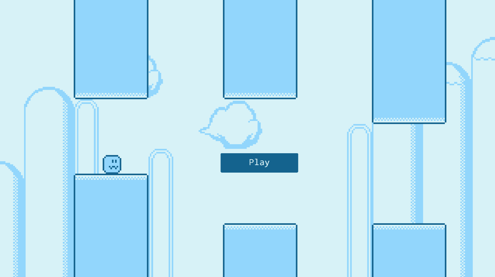

# Desktop Game made in JavaScript + Tauri

Flappy bird style game made with the Kaplay library and Tauri. It features a basic save system where your best score is saved on disk.

Supports multiple inputs (Mouse, Keyboard and Gamepad)

Tutorial on how to build this [here](https://www.youtube.com/watch?v=fyqRSaSJf0I)

Learn more about Tauri [here](https://tauri.app/)

## How to run?

1. Make sure you have completed the [Tauri prerequisites](https://tauri.app/v1/guides/getting-started/prerequisites)
2. Make sure you have [Node.js](https://nodejs.org) installed.
3. Clone the repo.
4. Once in the repo, do `npm install` to install the required dependencies.
5. Run the project in dev by doing `npm run dev`.

## How to distribute the project as an installable app?

1. Build the project by doing `npm run build`.
2. After the build is complete go to `target > release > bundle > msi`.
3. Distribute the installer on sites like itch.io or on Steam.

_Note : It's important to distribute the installer and not the .exe available in `target > release >  Your Game.exe` because Tauri relies on WebView2 to be present on the system.The installer will make sure to download and install it on the user's system if not already there. This is not the case for the .exe._

## What is Kaplay?

Kaplay is a very high-level library for making games. It allows you to make games really fast. It was previously called Kaboom.

Learn more about Kaplay [here](https://kaplayjs.com/)
